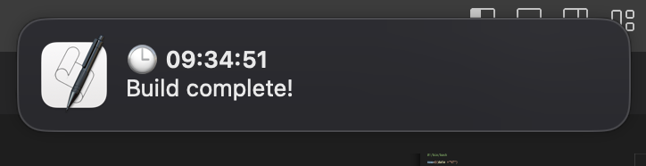

<h1 align="center">
  Notife
</h1>

<p align="center">
   
</p>

Notife is a command-line tool for displaying notifications on different operating systems. It's useful for notifying you when a long-running command has completed.

## Installation

Global installation:

`npm install notife -g`

Or local installation:

`npm install notife -save-dev`

## Usage

After installation, you can use the `notife` command from any directory or npm-command. Here's an example:

```bash
npx notife 'Hello World'
```

Add to the command in package.json:

```json
{
  "scripts": {
    ...
    "build": "npm run build && npx notife 'Build complete!'"
    ...
  }
}
```

This will display a notification with the message after the build is complete.

## Supported Operating Systems

- macOS: Uses `osascript` to display native notifications.
- Linux: Uses `notify-send` for notifications. Make sure it's installed on your system.
- Windows: Uses `powershell.exe` to display notifications. Ensure PowerShell is available.

## Contributing

Thank you for considering contributing to Notife! Your contributions help make this project better for everyone.

### Issues

If you find a bug, have a suggestion, or want to request a new feature, please open an issue on the [GitHub repository](https://github.com/dtlnv/notife) to discuss it.

### Pull Requests

If you'd like to contribute code to Notife, please follow these steps:

1. Fork the [Notife repository](https://github.com/dtlnv/notife) on GitHub.

2. Clone your forked repository to your local machine.

3. Create a new branch for your changes.

4. Make your changes, add tests if applicable, and ensure the existing tests pass.

5. Commit your changes and push your changes.

6. Open a pull request on the Notife repository and describe your changes and improvements. Your pull request will be reviewed, and once approved, it will be merged into the project!

## License

This project is licensed under the MIT License.

## Contact

If you have any questions or feedback, please don't hesitate to contact me: timtemnov@pm.me.